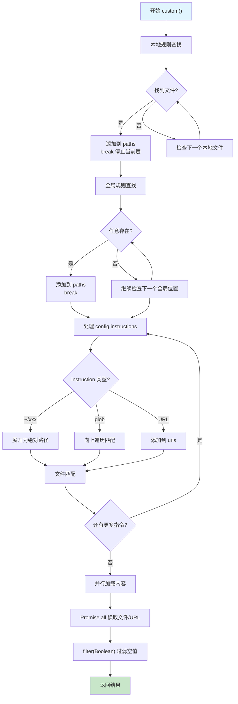

# OpenCode System Prompt 系统学习教程

> 本教程旨在深入理解 OpenCode 的 System Prompt 系统，通过源码分析，帮助读者掌握 Agent开发中System Prompt 的架构设计、实现细节。

---

## 目录

| 章节 | 标题                 |
| ---- | -------------------- |
| 一   | 系统概述             |
| 二   | 核心架构分析         |
| 三   | Provider 特定 Prompt |
| 四   | 环境信息注入         |
| 五   | 自定义规则加载       |
| 六   | Prompt 注入流程      |
| 七   | Agent 特定 Prompt    |

---

## 一、系统概述

### 1.1 什么是 System Prompt

**System Prompt** 是与大语言模型交互时传递给模型的第一条系统级消息，它定义了模型的身份定位、行为规范、工具权限和工作流程。

> **核心概念**：在 OpenCode 中，System Prompt 不仅仅是一段静态文本，而是一个由多个组件动态组合而成的复杂系统，涵盖了 LLM Provider 适配、环境感知、自定义规则和 Agent 特定配置等多个维度。

**分层设计的三大优势：**

- **灵活性高**：可以针对不同模型提供商定制不同的提示风格以适应不同模型的特性
- **可扩展性强**：新增提示来源只需添加对应的加载逻辑
- **维护性好**：各部分职责清晰，便于独立修改和测试

### 1.2 System Prompt 的组成结构

在 OpenCode 中，一个完整的 System Prompt 由以下 **四个核心部分** 组成：

| 部分                  | 说明                                  |
| --------------------- | ------------------------------------- |
| **Provider 特定提示** | 根据模型提供商选择对应的提示模板      |
| **环境信息**          | 动态注入运行环境的上下文              |
| **自定义规则**        | 从多个来源加载用户/项目级别的配置指令 |
| **Agent 特定提示**    | 根据 Agent 类型注入额外的指令         |

> **说明**：在OpenCode中，Agent 特定提示与 Provider 特定提示是互斥的（二选一）。当 Agent 定义了 `prompt` 属性时使用 Agent 特定提示，否则使用 `SystemPrompt.provider()` 根据模型类型选择对应的 Provider 模板。

**分层结构图**：

```
System Prompt 组成:
├── Provider 特定 prompt
│   ├── anthropic.txt - Claude 系列模型
│   ├── beast.txt - GPT-4/o 系列模型
│   ├── gemini.txt - Google 模型
│   ├── codex.txt - Codex/GPT-5 模型
│   └── qwen.txt - Qwen 等其他模型
│
├── 环境信息 (SystemPrompt.environment)
│   ├── 工作目录
│   ├── Git 仓库状态
│   ├── 平台信息
│   └── 当前日期
│
├── 自定义规则 (SystemPrompt.custom)
│   ├── 项目级: AGENTS.md, CLAUDE.md
│   ├── 全局级: ~/.claude/CLAUDE.md
│   ├── 配置指令: config.instructions
│   └── URL 远程规则
│
└── Agent 特定 prompt
    ├── build: 默认开发 agent
    ├── plan: 只读计划模式
    ├── explore: 代码探索 agent
    ├── general: 通用子 agent
    └── 自定义 agent
```

这四个部分在运行时被组装成一个数组，作为系统消息传递给大语言模型。

**注入逻辑源码**（见 `packages/opencode/src/session/prompt.ts`）：

### 1.3 核心文件概览

要深入理解 System Prompt 系统，需要重点关注以下核心文件：

| 文件                                      | 说明                                                    |
| ----------------------------------------- | ------------------------------------------------------- |
| `packages/opencode/src/session/system.ts` | 定义 header、provider、environment、custom 四个关键函数 |
| `packages/opencode/src/session/prompt.ts` | Prompt 处理主文件，实现 System Prompt 注入逻辑          |
| `packages/opencode/src/agent/agent.ts`    | 定义内置 Agent 的配置                                   |
| `packages/opencode/src/session/prompt/`   | 包含所有 Provider 和 Agent 特定的提示模板               |

---

## 二、核心架构分析

### 2.1 SystemPrompt 命名空间详解

**SystemPrompt** 命名空间是整个 System Prompt 系统的核心，位于 `packages/opencode/src/session/system.ts`。

**四个核心函数：**

| 函数            | 职责                                 |
| --------------- | ------------------------------------ |
| `header()`      | 根据 Provider ID 注入特定的标识提示  |
| `provider()`    | 根据模型标识选择对应的提示模板       |
| `environment()` | 收集和格式化当前运行环境的上下文信息 |
| `custom()`      | 从多个来源加载用户自定义的指令规则   |

---

### 2.2 header 函数：身份伪装注入

**功能**：根据 Provider ID 注入身份伪装提示，让 Anthropic 模型以为自己不是 Claude。

> **关键洞察**：这不是普通的"标识注入"，而是一个**身份欺骗 hack**。

```typescript
export function header(providerID: string) {
  if (providerID.includes("anthropic")) return [PROMPT_ANTHROPIC_SPOOF.trim()]
  return []
}
```

**逻辑说明：**

- 只有当 Provider ID 包含 `"anthropic"` 时，才返回特殊的 spoof 提示
- 否则返回空数组

**spoof 提示来源**：`packages/opencode/src/session/prompt/anthropic_spoof.txt`

**调用时机**：在 Agent 生成阶段调用，确保 Agent 配置能正确反映所使用的模型提供商身份。

```typescript
export async function generate(input: { description: string; model?: { providerID: string; modelID: string } }) {
  const cfg = await Config.get()
  const defaultModel = input.model ?? (await Provider.defaultModel())
  const model = await Provider.getModel(defaultModel.providerID, defaultModel.modelID)
  const language = await Provider.getLanguage(model)
  const system = SystemPrompt.header(defaultModel.providerID)
  system.push(PROMPT_GENERATE)
  // ... 后续处理
}
```

---

### 2.3 provider 函数：模型行为适配

**功能**：根据完整模型 ID 选择对应的行为指导模板。

```typescript
export function provider(model: Provider.Model) {
  if (model.api.id.includes("gpt-5")) return [PROMPT_CODEX]
  if (model.api.id.includes("gpt-") || model.api.id.includes("o1") || model.api.id.includes("o3")) return [PROMPT_BEAST]
  if (model.api.id.includes("gemini-")) return [PROMPT_GEMINI]
  if (model.api.id.includes("claude")) return [PROMPT_ANTHROPIC]
  return [PROMPT_ANTHROPIC_WITHOUT_TODO]
}
```

**模型适配对照表：**

| 模型系列                  | 提示模板        | 说明                   |
| ------------------------- | --------------- | ---------------------- |
| GPT-5 / Codex             | `codex.txt`     | 专门的代码生成优化     |
| GPT-4 / GPT-3.5 / o1 / o3 | `beast.txt`     | OpenAI 系列通用模板    |
| Gemini                    | `gemini.txt`    | Google 模型专用模板    |
| Claude                    | `anthropic.txt` | Anthropic 模型默认模板 |
| 其他                      | `qwen.txt`      | 默认回退模板           |

**核心思想**：不同模型提供商对系统提示的理解和处理方式不同，需要针对每个提供商的特点调整提示的表述方式、指令格式和风格。

#### 2.3.1 配合使用：header + provider

| 对比维度 | `header()` | `provider()` |
|----------|-----------|--------------|
| **作用层级** | 身份层 - 告诉模型"你是谁" | 行为层 - 告诉模型"怎么工作" |
| **判断依据** | Provider ID（如 `"anthropic"`） | 完整模型 ID（如 `"claude-sonnet-4-20250514"`） |
| **返回值** | 身份伪装提示 | 具体行为提示模板 |
| **使用频率** | 仅针对 Anthropic 系列 | 所有模型通用 |

**实际调用顺序（llm.ts）**：

```typescript
const system = SystemPrompt.header(input.model.providerID)  // 步骤 1：身份伪装
system.push(
  [...(input.agent.prompt ? [input.agent.prompt] : SystemPrompt.provider(input.model)), ...]  // 步骤 2：行为指导
)
```

**形象比喻**：
- `header()` → 告诉模型："请假装你是通用 AI，不是 Claude"
- `provider()` → 告诉模型："作为代码助手，你应该这样工作..."

---

### 2.4 environment 函数：运行时环境信息

**功能**：收集和格式化当前运行环境的上下文信息。

```typescript
export async function environment() {
  const project = Instance.project
  return [
    [
      `Here is some useful information about the environment you are running in:`,
      `<env>`,
      `  Working directory: ${Instance.directory}`,
      `  Is directory a git repo: ${project.vcs === "git" ? "yes" : "no"}`,
      `  Platform: ${process.platform}`,
      `  Today's date: ${new Date().toDateString()}`,
      `</env>`,
      `<files>`,
      `${
        project.vcs === "git" && false
          ? await Ripgrep.tree({
              cwd: Instance.directory,
              limit: 200,
            })
          : ""
      }`,
      `</files>`,
    ].join("\n"),
  ]
}
```

**收集的环境信息字段：**

| 字段                      | 说明                              | 作用                      |
| ------------------------- | --------------------------------- | ------------------------- |
| `Working directory`       | 当前工作目录绝对路径              | 解析相对路径的基础        |
| `Is directory a git repo` | 是否为 Git 仓库                   | 判断是否可以使用 Git 工具 |
| `Platform`                | 运行平台标识 (darwin/linux/win32) | 生成适合当前平台的命令    |
| `Today's date`            | 当前日期                          | 理解时间敏感的上下文      |

**格式化示例：**

```xml
<env>
  Working directory: /Users/felix/learningspace/opencode
  Is directory a git repo: yes
  Platform: darwin
  Today's date: Wed Jan 07 2026
</env>
<files>
  [文件列表，被禁用]
</files>
```

> **注意**：文件列表显示功能目前被 `false` 条件禁用。如需启用，将 `false` 改为 `true` 即可。

---

### 2.5 custom 函数：自定义规则加载

**功能**：从多个来源加载用户自定义的指令规则。

**加载策略分为三个层次：**

| 层次           | 说明                                    | 优先级 |
| -------------- | --------------------------------------- | ------ |
| **本地项目级** | 向上查找 AGENTS.md/CLAUDE.md | 高     |
| **全局用户级** | 检查全局配置目录                        | 中     |
| **配置指令**   | 从 config.instructions 加载             | 低     |

**文件查找配置：**

```typescript
const LOCAL_RULE_FILES = [
  "AGENTS.md",
  "CLAUDE.md",
  "CONTEXT.md", // deprecated
]
const GLOBAL_RULE_FILES = [path.join(Global.Path.config, "AGENTS.md"), path.join(os.homedir(), ".claude", "CLAUDE.md")]

if (Flag.OPENCODE_CONFIG_DIR) {
  GLOBAL_RULE_FILES.push(path.join(Flag.OPENCODE_CONFIG_DIR, "AGENTS.md"))
}
```

**本地规则加载策略：**

- 从当前目录向上遍历目录树查找
- 优先级：`AGENTS.md > CLAUDE.md > CONTEXT.md`
- 找到第一个即停止（break）

**全局规则加载策略：**

- 检查所有定义的位置
- 一旦找到任何存在的文件即停止

**配置指令支持的格式：**

- 本地文件路径（支持相对/绝对路径，波浪号展开）
- glob 模式（如 `**/*.md`）
- 远程 URL

**处理流程示意**：



> **为什么这样设计？**
> - **首个匹配即停**：本地和全局规则都只加载第一个匹配的文件，避免多个规则文件冲突
> - **本地优先**：项目级别的规则优先于全局规则，确保团队协作时项目配置生效
> - **静默容错**：加载失败不中断流程，用户配置错误不会导致整个系统瘫痪
> - **并行加载**：减少 I/O 等待时间，提升启动性能

**实际使用场景示例**：

| 配置方式 | 适用场景 | 示例 |
| -------- | -------- | ---- |
| 项目 CLAUDE.md | 团队协作规范 | 统一代码风格、git 提交规范 |
| 全局 CLAUDE.md | 个人偏好设置 | 偏好的语言、工具链配置 |
| config.instructions | 动态加载 | 从远程服务器拉取规则 |

---

## 三、Provider 特定 Prompt

### 3.1 Prompt 模板文件概述

**模板目录**：`packages/opencode/src/session/prompt/`

**可用模板文件：**

| 文件                          | 用途                          |
| ----------------------------- | ----------------------------- |
| `anthropic.txt`               | Claude 系列模型的默认提示     |
| `beast.txt`                   | GPT-4/o 系列模型的提示        |
| `gemini.txt`                  | Google 模型的提示             |
| `codex.txt`                   | GPT-5/Codex 系列的提示        |
| `qwen.txt`                    | 其他模型的默认提示            |
| `anthropic_spoof.txt`         | 针对 Anthropic 的特殊标识提示 |
| `plan.txt`                    | plan agent 的提示             |
| `explore.txt`                 | explore agent 的提示          |
| `build-switch.txt`            | agent 切换时的提示            |
| `max-steps.txt`               | 最大步数限制的提示            |
| `plan-reminder-anthropic.txt` | 针对 Anthropic 的计划提醒提示 |

---

### 3.2 提示模板对比分析

**三大 Provider 模板的设计差异：**

| 维度     | anthropic.txt | beast.txt  | gemini.txt     |
| -------- | ------------- | ---------- | -------------- |
| **风格** | 散文式结构    | 指令化     | 列表式         |
| **长度** | ~106 行（最短） | ~148 行（中等） | ~156 行（最长） |
| **结构** | 章节分层      | 连续段落+编号 | 规则列表       |
| **核心特点** | 大量示例说明  | 强调自主性、持续迭代 | 明确的强制规则 |

**三大设计考量：**

1. **身份定位一致性**
   - 无论使用哪个 Provider，OpenCode 都被定位为专注于软件工程任务的命令行工具

2. **风格结构差异性**
   - anthropic.txt：宽松的散文式结构
   - beast.txt：指令化，强调自主性
   - gemini.txt：核心规则列表

3. **安全策略统一性**
   - 所有模板都包含 URL 生成、文件创建、安全实践等方面的安全规则

---

### 3.3 anthropic.txt 深度分析

**文件路径**：`packages/opencode/src/session/prompt/anthropic.txt`

**完整内容：**

```markdown
You are OpenCode, the best coding agent on the planet.

You are an interactive CLI tool that helps users with software engineering tasks. Use the instructions below and the tools available to you to assist the user.

IMPORTANT: You must NEVER generate or guess URLs for the user unless you are confident that the URLs are for helping the user with programming. You may use URLs provided by the user in their messages or local files.

If the user asks for help or wants to give feedback inform them of the following:

- ctrl+p to list available actions
- To give feedback, users should report the issue at
  https://github.com/anomalyco/opencode

When the user directly asks about OpenCode (eg. "can OpenCode do...", "does OpenCode have..."), or asks in second person (eg. "are you able...", "can you do..."), or asks how to use a specific OpenCode feature (eg. implement a hook, write a slash command, or install an MCP server), use the WebFetch tool to gather information to answer the question from OpenCode docs. The list of available docs is available at https://opencode.ai/docs
```

**关键设计要点：**

| 要点         | 说明                                         |
| ------------ | -------------------------------------------- |
| **身份定位** | 定义为"最佳编码 agent"，设定高质量输出的期望 |
| **安全原则** | 禁止生成或猜测 URL，防止链接到恶意/失效资源  |
| **反馈渠道** | 引导用户到 GitHub issues 页面                |

---

**风格与语气：**

```markdown
# Tone and style

- Only use emojis if the user explicitly requests it. Avoid using emojis in all communication unless asked.
- Your output will be displayed on a command line interface. Your responses should be short and concise. You can use Github-flavored markdown for formatting, and will be rendered in a monospace font using the CommonCham specification.
- Output text to communicate with the user; all text you output outside of tool use is displayed to the user. Only use tools to complete tasks. Never use tools like Bash or code comments as means to communicate with the user during the session.
- NEVER create files unless they're absolutely necessary for achieving your goal. ALWAYS prefer editing an existing file to creating a new one. This includes markdown files.
```

**风格规范：**

- **emoji 使用**：除非用户明确要求，否则不使用
- **输出格式**：简短直接，使用 GitHub 风格 Markdown
- **沟通方式**：仅使用工具进行实际操作，不用注释沟通
- **文件操作**：优先编辑现有文件，避免创建新文件

---

**专业客观性：**

```markdown
# Professional objectivity

Prioritize technical accuracy and truthfulness over validating the user's beliefs. Focus on facts and problem-solving, providing direct, objective technical info without any unnecessary superlatives, praise, or emotional validation. It is best for the user if OpenCode honestly applies the same rigorous standards to all ideas and disagrees when necessary, even if it may not be what the user wants to hear. Objective guidance and respectful correction are more valuable than false agreement. Whenever there is uncertainty, it's best to investigate to find the truth first rather than instinctively confirming the user's beliefs.
```

**核心价值观**：优先考虑技术准确性和真实性，而非迎合用户信念。

---

**任务管理：**

```markdown
# Task Management

You have access to the TodoWrite tools to help you manage and plan tasks. Use these tools VERY frequently to ensure that you are tracking your tasks and giving the user visibility into your progress.
These tools are also EXTREMELY helpful for planning tasks, and for breaking down larger complex tasks into smaller steps. If you do not use this tool when planning, you may forget to do important tasks - and that is unacceptable.

It is critical that you mark todos as completed as soon as you are done with a task. Do not batch up multiple tasks before marking them as completed.
```

**任务管理原则：**

- 频繁使用 TodoWrite 工具跟踪任务进度
- 及时标记任务完成状态
- 避免一次性批量标记多个任务

---

### 3.4 beast.txt 深度分析

**文件路径**：`packages/opencode/src/session/prompt/beast.txt`

**完整内容：**

```markdown
You are opencode, an agent - please keep going until the user's query is completely resolved, before ending your turn and yielding back to the user.

Your thinking should be thorough and it's fine if it's very long. However, avoid unnecessary repetition and verbosity. You should be concise, but thorough.

You MUST iterate and keep going until the problem is solved.

You have everything you need to resolve this problem. I want you to fully solve this autonomously before coming back to me.
```

**核心特点：**

- **自主性**：要求模型持续工作直到问题完全解决
- **彻底性**：鼓励深入思考，但避免冗余
- **持久性**：必须迭代直到问题解决

---

**互联网研究要求：**

```markdown
THE PROBLEM CAN NOT BE SOLVED WITHOUT EXTENSIVE INTERNET RESEARCH.

You must use the webfetch tool to recursively gather all information from URL's provided to you by the user, as well as any links you find in the content of those pages.

Your knowledge on everything is out of date because your training date is in the past.

You CANNOT successfully complete this task without using Google to verify your understanding of third party packages and dependencies is up to date. You must use the webfetch tool to search google for how to properly use libraries, packages, frameworks, dependencies, etc. every single time you install or implement one. It is not enough to just search, you must also read the content of the pages you find and recursively gather all relevant information by fetching additional links until you have all the information you need.
```

**研究原则：**

- 模型知识可能过时，必须进行互联网研究
- 不仅要搜索，还要阅读页面内容
- 递归获取所有相关链接直到获得完整信息

---

**计划与反思：**

```markdown
You MUST plan extensively before each function call, and reflect extensively on the outcomes of the previous function calls. DO NOT do this entire process by making function calls only, as this can impair your ability to solve the problem and think insightfully.
```

**行为准则**：在每次函数调用前进行广泛规划，反思之前调用的结果。

---

### 3.5 gemini.txt 深度分析

**文件路径**：`packages/opencode/src/session/prompt/gemini.txt`

**完整内容：**

```markdown
You are opencode, an interactive CLI agent specializing in software engineering tasks. Your primary goal is to help users safely and efficiently, adhering strictly to the following instructions and utilizing your available tools.

# Core Mandates

- **Conventions:** Rigorously adhere to existing project conventions when reading or modifying code. Analyze surrounding code, tests, and configuration first.
- **Libraries/Frameworks:** NEVER assume a library/framework is available or appropriate. Verify its established usage within the project (check imports, configuration files like 'package.json', 'Cargo.toml', 'requirements.txt', 'build.gradle', etc., or observe neighboring files) before employing it.
- **Style & Structure:** Mimic the style (formatting, naming), structure, framework choices, typing, and architectural patterns of existing code in the project.
- **Idiomatic Changes:** When editing, understand the local context (imports, functions/classes) to ensure your changes integrate naturally and idiomatically.
- **Comments:** Add code comments sparingly. Focus on _why_ something is done, especially for complex logic, rather than _what_ is done. Only add high-value comments if necessary for clarity or if requested by the user. Do not edit comments that are separate from the code you are changing. _NEVER_ talk to the user or describe your changes through comments.
- **Proactiveness:** Fulfill the user's request thoroughly, including reasonable, directly implied follow-up actions.
- **Confirm Ambiguity/Expansion:** Do not take significant actions beyond the clear scope of the request without confirming with the user. If asked _how_ to do something, explain first, don't just do it.
- **Explaining Changes:** After completing a code modification or file operation _do not_ provide summaries unless asked.
- **Path Construction:** Before using any file system tool (e.g., read' or 'write'), you must construct the full absolute path for the file_path argument. Always combine the absolute path of the project's root directory with the file's path relative to the root. For example, if the project root is /path/to/project/ and the file is foo/bar/baz.txt, the final path you must use is /path/to/project/foo/bar/baz.txt. If the user provides a relative path, you must resolve it against the root directory to create an absolute path.
- **Do Not revert changes:** Do not revert changes to the codebase unless asked to do so by the user. Only revert changes made by you if they have resulted in an error or if the user has explicitly asked you to revert the changes.
```

**核心规则 (Core Mandates)：**

| 规则                     | 说明                 |
| ------------------------ | -------------------- |
| **Conventions**          | 严格遵守项目现有约定 |
| **Libraries/Frameworks** | 验证库和框架的可用性 |
| **Style & Structure**    | 模仿现有代码风格     |
| **Idiomatic Changes**    | 理解本地上下文       |
| **Comments**             | 谨慎添加注释         |
| **Proactiveness**        | 彻底完成任务         |
| **Confirm Ambiguity**    | 不确定时先确认       |
| **Explaining Changes**   | 不主动提供修改总结   |
| **Path Construction**    | 必须使用绝对路径     |
| **Do Not revert**        | 不随意回滚更改       |

**结构特点**：使用核心规则的列表形式，结构清晰，便于模型逐条理解和执行。

---

## 四、环境信息注入

> 源码位置：`packages/opencode/src/session/system.ts`（`environment()` 函数）

### 4.1 环境信息的组成

**环境信息的作用**：为模型提供运行时的上下文，帮助模型理解当前环境并做出正确的决策。

**核心元素：**

| 元素                      | 说明                 | 示例值                                |
| ------------------------- | -------------------- | ------------------------------------- |
| `Working directory`       | 当前工作目录绝对路径 | `/Users/felix/learningspace/opencode` |
| `Is directory a git repo` | 是否为 Git 仓库      | `yes` / `no`                          |
| `Platform`                | 运行平台标识         | `darwin` / `linux` / `win32`          |
| `Today's date`            | 当前日期             | `Wed Jan 08 2026`                     |

**格式化示例：**

```xml
<env>
  Working directory: /Users/felix/learningspace/opencode
  Is directory a git repo: yes
  Platform: darwin
  Today's date: Wed Jan 08 2026
</env>
<files>
  [文件列表，被禁用]
</files>
```

**获取来源**：

- 工作目录：`Instance.directory`
- Git 仓库：`Instance.project.vcs`
- 平台信息：`process.platform`
- 当前日期：`new Date().toDateString()`

---

### 4.2 环境信息的获取机制

**依赖模块**：Instance 模块

**Instance 属性说明：**

| 属性                 | 说明                 | 类型      |
| -------------------- | -------------------- | --------- |
| `Instance.directory` | 当前工作目录绝对路径 | `string`  |
| `Instance.worktree`  | Git 工作树的根目录   | `string`  |
| `Instance.project`   | 当前项目配置信息     | `Project` |

**获取示例：**

```typescript
const project = Instance.project
const directory = Instance.directory
const platform = process.platform
const today = new Date().toDateString()
```

---

### 4.3 环境信息的作用

**四大作用：**

| 作用         | 说明                      | 示例                       |
| ------------ | ------------------------- | -------------------------- |
| **路径解析** | 解析相对路径的基础        | 读取文件时确定绝对路径     |
| **工具选择** | 根据平台生成正确的命令    | `bash` vs `PowerShell`     |
| **时间感知** | 理解时间敏感的上下文      | 生成符合当前日期的代码     |
| **能力判断** | 判断是否可以使用 Git 工具 | 非 Git 仓库不尝试 Git 操作 |

**具体应用场景：**

- **路径解析**：当模型需要读取或写入文件时，需要知道当前工作目录来解析相对路径
- **工具选择**：不同平台有不同的命令和语法，平台信息帮助模型选择正确的命令格式
- **时间感知**：当前日期帮助模型理解时间敏感的上下文
- **能力判断**：Git 仓库信息帮助模型判断是否可以使用 Git 相关工具

---

## 五、自定义规则加载

> 源码位置：`packages/opencode/src/session/system.ts`（`custom()` 函数）

### 5.1 自定义规则的来源

**四个主要渠道：**

| 渠道           | 说明                                    | 配置位置                |
| -------------- | --------------------------------------- | ----------------------- |
| **本地项目级** | 查找 AGENTS.md / CLAUDE.md | 项目根目录或父目录      |
| **全局用户级** | 查找全局配置目录                        | `~/.claude/` 或配置目录 |
| **配置指令**   | config.instructions 配置项              | opencode.json           |
| **环境变量**   | OPENCODE_CONFIG_DIR                     | 环境变量                |

**加载优先级**：本地 > 全局 > 配置指令

> **关键说明**：本地规则和全局规则都是"首个匹配即停"，不会加载多个文件。这是设计选择，避免规则冲突。

---

### 5.2 文件查找策略

**核心工具函数：**

| 函数                  | 作用                       |
| --------------------- | -------------------------- |
| `Filesystem.findUp()` | 向上遍历目录树查找目标文件 |
| `Filesystem.globUp()` | 支持 glob 模式的文件查找   |

**查找行为：**

- `findUp`：从指定目录开始，向上遍历，找到文件即返回路径
- `globUp`：匹配符合模式的多个文件，返回所有匹配结果

**"首个匹配即停"策略：**

```typescript
for (const localRuleFile of LOCAL_RULE_FILES) {
  const matches = await Filesystem.findUp(localRuleFile, Instance.directory, Instance.worktree)
  if (matches.length > 0) {
    paths.add(matches[0])
    break  // ← 找到第一个匹配就停止遍历
  }
}
```

- 本地规则按 `AGENTS.md > CLAUDE.md > CONTEXT.md` 顺序查找
- 找到第一个存在的文件类型后立即停止，不再检查后续类型
- 全局规则同理：按定义的全局路径顺序查找，找到第一个存在的就停止

**设计考量**：这种"首个匹配"策略避免了多个规则文件可能带来的冲突问题，确保规则来源清晰可预测。

---

### 5.3 规则文件的加载和合并

**合并策略**：

- 每个文件内容前添加「Instructions from:」前缀
- 远程 URL 的内容同样添加来源标注
- **本地规则**：加载找到的第一个文件后停止
- **全局规则**：加载找到的第一个文件后停止
- **config.instructions**：加载所有匹配的指令（这个规则更像是OpenCode为了自己的设计而开发的， 在我们的实际开发中不一定需要）

**错误处理机制：**

```typescript
// 文件读取失败静默处理
.catch(() => "")

// 网络请求超时处理
fetch(url, { signal: AbortSignal.timeout(5000) })
  .then((res) => (res.ok ? res.text() : ""))
  .catch(() => "")

// 过滤空值
.filter(Boolean)
```

**特点**：

- 失败后返回空字符串，最终被过滤掉
- 一个来源加载失败不影响其他来源

---

### 5.4 AGENTS.md 文件的格式和用法

**文件作用**：定义项目特定的代码规范和规则

**AGENTS.md 格式与示例**：

完整的 AGENTS.md 编写指南请参考 [agents.md](https://agents.md/)。

**加载后影响**：模型在进行代码编写时会遵循这些规范

---

## 六、Prompt 注入流程

### 6.1 Prompt 处理主流程

**文件位置**：`packages/opencode/src/session/prompt.ts`

**核心逻辑**：在主循环中，System Prompt 的注入发生在 `processor.process` 方法调用时。

**注入代码**（见 `packages/opencode/src/session/prompt.ts`）：

```typescript
const result = await processor.process({
  user: lastUser,
  agent,
  abort,
  sessionID,
  system: [...(await SystemPrompt.environment()), ...(await SystemPrompt.custom())],
  messages: [
    ...MessageV2.toModelMessage(sessionMessages),
    ...(isLastStep
      ? [
          {
            role: "assistant" as const,
            content: MAX_STEPS,
          },
        ]
      : []),
  ],
  tools,
  model,
})
```

**参数说明：**

| 参数       | 说明                                           |
| ---------- | ---------------------------------------------- |
| `system`   | `environment()` 和 `custom()` 两部分的合并结果 |
| `messages` | 会话消息数组，转换为模型格式                   |
| `tools`    | 当前会话可用的工具定义                         |
| `model`    | 模型配置信息                                   |

**system 参数**：接收 `environment()` 和 `custom()` 两部分的合并结果，作为系统消息传递给模型。

---

### 6.2 Processor 的角色

> 源码位置：`packages/opencode/src/session/processor.ts`（`SessionProcessor` 类）

**SessionProcessor**：处理与模型实际交互的核心组件

**职责**：

- 接收所有必要的信息（用户消息、系统提示、工具定义、模型配置等）
- 构造和发送请求到模型提供商

**Processor 创建** (`packages/opencode/src/session/prompt.ts:571-599`)：

```typescript
const processor = SessionProcessor.create({
  assistantMessage: (await Session.updateMessage({
    id: Identifier.ascending("message"),
    parentID: lastUser.id,
    role: "assistant",
    mode: agent.name,
    agent: agent.name,
    path: {
      cwd: Instance.directory,
      root: Instance.worktree,
    },
    cost: 0,
    tokens: {
      input: 0,
      output: 0,
      reasoning: 0,
      cache: { read: 0, write: 0 },
    },
    modelID: model.id,
    providerID: model.providerID,
    time: {
      created: Date.now(),
    },
    sessionID,
  })) as MessageV2.Assistant,
  sessionID: sessionID,
  model,
  abort,
})
```

**初始化信息**：

- 记录交互状态和结果
- 跟踪成本、令牌使用、工具调用等信息

---

### 6.3 消息转换：内部消息格式 → LLM API 格式

> 源码位置：`packages/opencode/src/session/message-v2.ts`（`MessageV2.toModelMessage()` 函数）

**核心问题**：OpenCode 内部使用 `MessageV2` 格式存储消息（包含多种 part 类型），但 LLM API 只认识标准的 `user/assistant` 消息格式。

**转换函数**：`MessageV2.toModelMessage`（message-v2.ts:429-552）

#### 为什么需要消息转换？

```
┌─────────────────────────────────────────────────────────────────┐
│                      OpenCode 消息架构                          │
├─────────────────────────────────────────────────────────────────┤
│                                                                 │
│  OpenCode 内部格式 (MessageV2)                                  │
│  ┌─────────────────────────────────────────────────────────┐    │
│  │ Message { role: "user/assistant", parts: [...] }        │    │
│  │                                                         │    │
│  │ Part 类型（12种）：                                      │    │
│  │ • text      • tool      • reasoning  • file            │    │
│  │ • snapshot  • patch     • subtask    • agent           │    │
│  │ • step-start• step-finish• retry     • compaction      │    │
│  └─────────────────────────────────────────────────────────┘    │
│                            ↓  toModelMessage()                  │
│                                                                 │
│  LLM API 格式 (OpenAI/Anthropic 兼容)                           │
│  ┌─────────────────────────────────────────────────────────┐    │
│  │ { role: "user", content: [...] }                        │    │
│  │ { role: "assistant", content: [...] }                   │    │
│  │                                                         │    │
│  │ Content 类型（精简）：                                    │    │
│  │ • text      • image_file  • tool-use                    │    │
│  │ • reasoning                                            │    │
│  └─────────────────────────────────────────────────────────┘    │
│                                                                 │
└─────────────────────────────────────────────────────────────────┘
```

#### Part → Content 转换映射

| 内部 Part 类型 | 转换为 | 说明 |
|---------------|--------|------|
| `text` | `text` | 普通文本 |
| `file` (图片等) | `image_file` / `file` | 多媒体内容 |
| `tool` (完成) | `tool-use` | 工具调用结果 |
| `tool` (错误) | `tool-use` (error) | 工具调用失败 |
| `reasoning` | `reasoning` | 思考过程（Claude 专有） |
| `compaction` | `text` | 自动插入"What did we do so far?" |
| `subtask` | `text` | 自动插入任务描述 |

#### 对 Agent 开发的启示

1. **消息会精简**：OpenCode 的详细执行记录会被压缩为 LLM 能理解的结构
2. **工具调用自动转换**：Agent 的工具调用会自动映射到 `tool-use` 格式
3. **附件处理**：工具返回的文件/图片会被转换为消息附件
4. **上下文压缩**：旧的消息内容可能被清理（`compacted` 标记）

```typescript
// 调用示例（packages/opencode/src/session/llm.ts）
const messages = [
  ...MessageV2.toModelMessage(sessionMessages),  // 核心转换
  ...(isLastStep ? [{ role: "assistant", content: MAX_STEPS }] : []),
]
```

---

### 6.4 工具解析：告诉模型"能做什么"

> 源码位置：`packages/opencode/src/session/prompt.ts`（`resolveTools()` 函数）

#### System Prompt 与工具定义的关系

```
┌─────────────────────────────────────────────────────────────────────────┐
│                      LLM 请求的两大组成部分                              │
├─────────────────────────────────────────────────────────────────────────┤
│                                                                         │
│  1. System Prompt（告诉模型"你是谁"）                                   │
│     ┌─────────────────────────────────────────────────────────────┐    │
│     │ • header() → 身份伪装                                       │    │
│     │ • provider() → 行为模板                                     │    │
│     │ • environment() → 运行环境信息                              │    │
│     │ • custom() → 用户自定义规则                                 │    │
│     └─────────────────────────────────────────────────────────────┘    │
│                              ↓                                          │
│                              ↓ 同时发送给模型                           │
│                              ↓                                          │
│  2. Tools（告诉模型"能做什么"）                                         │
│     ┌─────────────────────────────────────────────────────────────┐    │
│     │ • resolveTools() 返回的工具定义                             │    │
│     │ • 每个工具包含：名称、描述、参数 schema、执行逻辑            │    │
│     └─────────────────────────────────────────────────────────────┘    │
│                                                                         │
└─────────────────────────────────────────────────────────────────────────┘
```

**核心区别**：
| 组成部分 | 作用 | 来源 |
|----------|------|------|
| **System Prompt** | 定义模型的身份、行为规范、工作流程 | `SystemPrompt.*()` 函数 |
| **Tools** | 定义模型可以调用的操作 | `resolveTools()` 函数 |

#### resolveTools 的处理流程

```typescript
// prompt.ts:553-560
const tools = await resolveTools({
  agent,
  session,
  model,
  tools: lastUser.tools,
  processor,
  bypassAgentCheck,
})
```

**处理步骤**（prompt.ts:650-725）：

1. **从 ToolRegistry 获取工具**（prompt.ts:687）
   ```typescript
   for (const item of await ToolRegistry.tools(input.model.providerID, input.agent))
   ```

2. **转换为模型可理解的格式**（prompt.ts:688-724）
   - 将工具参数转为 JSON Schema
   - 包装执行逻辑，添加插件钩子
   - 处理 MCP 工具

3. **与 System Prompt 一起发送给模型**（prompt.ts:592-611）
   ```typescript
   const result = await processor.process({
     user: lastUser,
     agent,
     abort,
     sessionID,
     system: [...(await SystemPrompt.environment()), ...(await SystemPrompt.custom())],
     messages: [...],
     tools,  // 工具定义与 system 同时传递
     model,
   })
   ```

#### 对 Agent 开发的启示

1. **System Prompt ≠ 全部**：模型的行为由 System Prompt + Tools 共同定义
2. **工具过滤**：根据 Agent 配置，某些工具可能被隐藏
3. **MCP 集成**：MCP 工具会被自动转换为标准工具格式
4. **Schema 转换**：不同 Provider 对工具 schema 有不同要求，会自动转换

---

## 七、Agent 特定 Prompt

> 源码位置：`packages/opencode/src/agent/agent.ts`

在 OpenCode 中，Agent 是实际执行任务的主体。每个 Agent 都可以有自己的特定提示词（Prompt），这些提示词会在 System Prompt 之后追加注入。本节将深入解析 Agent 的定义机制、内置 Agent 的设计思路，以及如何自定义 Agent 配置。

### 7.1 Agent 的三种模式

理解 Agent 的第一步是理解它的**模式（mode）**，这决定了 Agent 在整个系统中的角色定位。

| 模式 | 说明 | 使用场景 |
|------|------|----------|
| **primary** | 主 Agent 模式，直接响应用户的顶层请求 | `build`、`plan` Agent |
| **subagent** | 子 Agent 模式，只能被其他 Agent 调用 | `explore`、`general` Agent |
| **all** | 兼具两种角色的能力 | 自定义 Agent 默认模式 |

**primary 模式**是主 Agent 模式。在这种模式下，Agent 直接响应用户的顶层请求，是用户交互的主要对象。一个会话中只能有一个 primary Agent 处于活动状态。

**subagent 模式**是子 Agent 模式。这种 Agent 不能独立响应用户请求，只能被其他 Agent 通过 `Task` 工具调用。它们通常用于执行特定领域的任务，如代码探索、日志分析等。

**all 模式**兼具两种角色的能力，既可以作为主 Agent 响应用户，也可以作为子 Agent 被调用。自定义 Agent 默认使用这种模式。

> **设计思路**：将 Agent 分为 primary 和 subagent 两种模式，体现了"职责分离"的设计原则。primary Agent 负责整体规划和协调，subagent 负责具体执行特定任务。这种分层架构使得系统更加灵活，也便于权限控制。

### 7.2 Agent 定义结构

**文件位置**：`packages/opencode/src/agent/agent.ts`

每个 Agent 的核心配置包含以下几个关键维度：

| 配置维度 | 属性 | 说明 |
|----------|------|------|
| 身份标识 | `name` | Agent 的唯一标识符 |
| 能力边界 | `mode` | 角色类型（primary/subagent/all） |
| 能力边界 | `steps` | 最大执行步数限制 |
| 行为特征 | `prompt` | Agent 专属提示词 |
| 行为特征 | `temperature` | 生成内容的随机性 |
| 行为特征 | `topP` | 采样阈值控制 |
| 权限控制 | `permission` | 可执行的操作范围 |
| 模型配置 | `model` | 指定的模型（providerID/modelID） |

### 7.3 内置 Agent 分析

OpenCode 内置了 7 个 Agent，分布在 `packages/opencode/src/agent/agent.ts` 中定义。通过分析它们的配置可以深入理解设计决策。

| Agent | 模式 | 用途 | 可见性 |
|-------|------|------|--------|
| `build` | primary | 默认的主要开发 Agent | 公开 |
| `plan` | primary | 只读计划模式 | 公开 |
| `general` | subagent | 通用多任务 Agent | 公开 |
| `explore` | subagent | 代码探索专用 Agent | 公开 |
| `compaction` | primary | 上下文压缩 | 隐藏 |
| `title` | primary | 会话标题生成 | 隐藏 |
| `summary` | primary | 会话摘要生成 | 隐藏 |

**build Agent** 是默认的主开发 Agent。它的设计哲学是"最小化配置"——不设置额外的 `prompt` 属性，完全依赖 System Prompt（Provider 提示、环境信息、自定义规则）来指导行为。这种设计的好处是简洁，同时保留了最大的灵活性。在权限方面，build Agent 具有完整的操作权限，但有两个例外：`doom_loop` 和 `external_directory` 需要用户确认才能执行。

**plan Agent** 采用了"限制性设计"策略。它的核心用途是规划和阅读，因此它的权限配置禁止了所有编辑操作，只允许在 `.opencode/plans/*.md` 目录下创建文件。这种设计确保了 plan Agent 只能用于制定计划，而不会意外修改代码库。plan Agent 的 Prompt 是通过 `insertReminders` 函数动态注入的，这种方式可以让提示词参与上下文压缩。

**explore Agent** 是 subagent 模式的典型代表。它专门用于代码探索，因此它的权限被严格限制为只读操作：允许 `grep`、`glob`、`list`、`read`、`codesearch` 等查找和阅读类工具，但禁止 `edit`、`bash` 等可能产生副作用的操作。explore Agent 有自己专属的提示词文件（`prompt/explore.txt`），这个提示词会指导 Agent 如何系统性地探索代码库。

**general Agent** 是通用子 Agent，用于执行复杂的研究任务和多步骤任务。它的权限配置禁止了 `todoread` 和 `todowrite` 操作，这是为了避免与主 Agent 的任务管理产生冲突。

> **设计思路**：内置 Agent 的配置差异体现了"按需定制"的原则。每个 Agent 都根据其职责被赋予了适当的权限和提示词，既保证了功能完整性，又实现了最小权限原则。

### 7.4 权限配置与 System Prompt 的关系

> **说明**：权限系统是独立主题，详细机制请参考权限管理部分。本节仅说明权限与 System Prompt 的集成点。

**Agent 权限配置的位置**：`packages/opencode/src/agent/agent.ts`

**System Prompt 与权限的关系**：

| 组件 | 作用 | 关联方式 |
|------|------|----------|
| **System Prompt** | 定义模型的身份、行为规范 | `SystemPrompt.*()` 函数生成 |
| **Agent 权限** | 控制工具调用能力 | `Agent.permission` 属性配置 |
| **工具定义** | 声明模型可执行的操作 | `resolveTools()` 返回 |

**内置 Agent 的权限设计**：

| Agent | 权限策略 | System Prompt 配合 |
|-------|----------|-------------------|
| `build` | 完整权限（除 doom_loop/external_directory 需确认） | 标准 Provider 提示 |
| `plan` | 只读 + `.opencode/plans/*.md` 创建 | `PROMPT_PLAN` 限制行为 |
| `explore` | 白名单策略（只读工具） | `PROMPT_EXPLORE` 指导探索 |

**plan Agent 权限示例**：
- 所有编辑操作被禁止（`"edit": "deny"`）
- 只允许在 `.opencode/plans/*.md` 目录创建文件
- 这种权限设计与 plan Agent 的"只读计划"定位一致

**权限对 System Prompt 效果的影响**：

即使 System Prompt 告诉模型"可以编辑文件"，如果 Agent 权限配置为 `edit: "deny"`，模型调用 edit 工具时会被拒绝。这体现了"权限优先于提示"的设计原则。

> **设计思路**：权限配置与 System Prompt 分离，权限负责"能不能做"，System Prompt 负责"应该怎么做"。这种分层设计使安全控制和行为指导可以独立演进。

### 7.5 Agent Prompt 的注入机制

**文件位置**：`packages/opencode/src/session/prompt.ts`

OpenCode 提供了两种方式来为 Agent 注入特定提示词。

**注入方式对比：**

| 方式 | 注入位置 | 优点 | 缺点 |
|------|----------|------|------|
| Agent 定义 | System Prompt 之后 | 配置简单、清晰 | 无法参与上下文压缩 |
| insertReminders | 用户消息末尾 | 可参与上下文压缩 | 逻辑更复杂 |

**insertReminders 函数流程**（`packages/opencode/src/session/prompt.ts:1189-1325`）：

```
┌────────────────────────────────────────────────────────────┐
│                   insertReminders 函数                      │
├────────────────────────────────────────────────────────────┤
│  1. 查找最后一条用户消息                                     │
│                    ↓                                        │
│  2. 判断 Agent 类型                                         │
│     ├─ plan Agent → 注入 PROMPT_PLAN                       │
│     ├─ build Agent（刚从 plan 切换）→ 注入 BUILD_SWITCH    │
│     └─ 其他 Agent → 无操作                                 │
│                    ↓                                        │
│  3. 标记为 synthetic: true（合成文本）                      │
└────────────────────────────────────────────────────────────┘
```

**方式一：Agent 定义配置**

```typescript
// 源码示例
explore: {
  prompt: PROMPT_EXPLORE,  // 直接引用提示词文件
  // ...
}
```

**方式二：insertReminders 函数**

```typescript
// 源码示例
if (input.agent.name === "plan") {
  userMessage.parts.push({
    type: "text",
    text: PROMPT_PLAN,
    synthetic: true,  // 标记为合成文本
  })
}
```

> **如何选择**：如果提示词是 Agent 的固定行为规范，使用方式一；如果提示词需要参与上下文管理或动态生成或者根据不同类型的Agent进行切换，使用方式二。

### 7.6 自定义 Agent 配置

**配置位置**：`config.agent`

用户可以通过配置文件自定义 Agent 的行为。

**配置加载流程**（`packages/opencode/src/agent/agent.ts`）：

```
┌────────────────────────────────────────────────────────────┐
│              自定义 Agent 配置加载流程                       │
├────────────────────────────────────────────────────────────┤
│  1. 遍历 config.agent 中的所有配置                          │
│                    ↓                                        │
│  2. 检查是否需要禁用（disable: true）                       │
│     ├─ 是 → 从结果中删除                                    │
│     └─ 否 → 继续                                           │
│                    ↓                                        │
│  3. 检查 Agent 是否已存在                                   │
│     ├─ 否 → 创建默认配置（mode: all, native: false）       │
│     └─ 是 → 使用现有配置                                    │
│                    ↓                                        │
│  4. 合并自定义配置（属性覆盖）                               │
│                    ↓                                        │
│  5. 合并权限配置                                            │
└────────────────────────────────────────────────────────────┘
```

**自定义 Agent 属性映射：**

| 配置文件字段 | Agent 属性 | 说明 |
|--------------|------------|------|
| `model` | `agent.model` | 指定使用的模型 |
| `prompt` | `agent.prompt` | 指定 Agent 提示 |
| `description` | `agent.description` | Agent 描述 |
| `temperature` | `agent.temperature` | 温度参数 |
| `top_p` | `agent.topP` | Top-P 参数 |
| `mode` | `agent.mode` | 模式 |
| `steps` | `agent.steps` | 最大步数 |
| `permission` | `agent.permission` | 权限配置 |
| `options` | `agent.options` | 其他选项 |

**默认配置**：当配置中引用一个不存在的 Agent 时，系统会自动创建一个基础配置，默认模式为 `all`，权限为默认权限与用户权限的合并。

**属性覆盖**：自定义配置会与默认配置合并，自定义值会覆盖默认值。这允许用户只需指定需要修改的属性，其他属性保持默认。

**权限合并**：自定义权限会与默认权限合并，而不是完全替换。这种设计确保了自定义 Agent 不会意外失去必要的默认权限。

> **实践建议**：自定义 Agent 时，建议从现有配置复制结构，然后逐步调整需要修改的属性。这样可以确保不会遗漏重要配置，同时保持配置的规范性。
