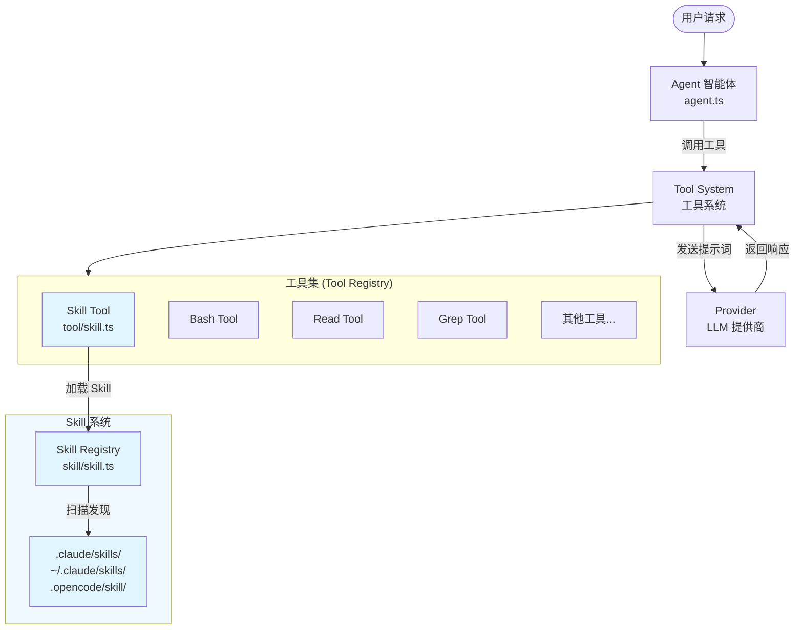
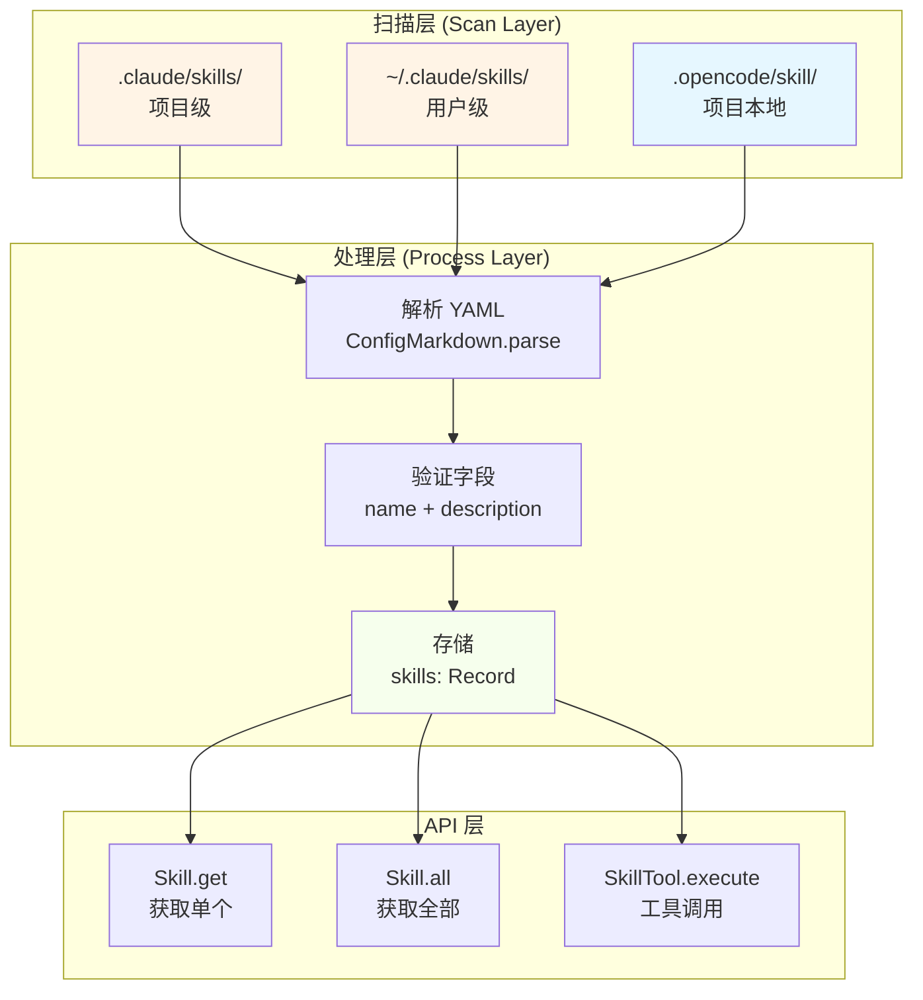
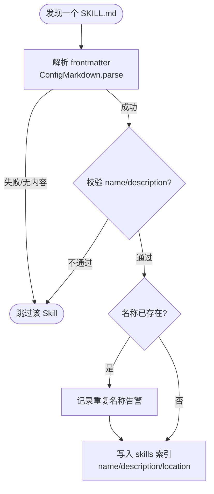
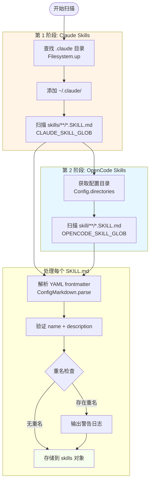
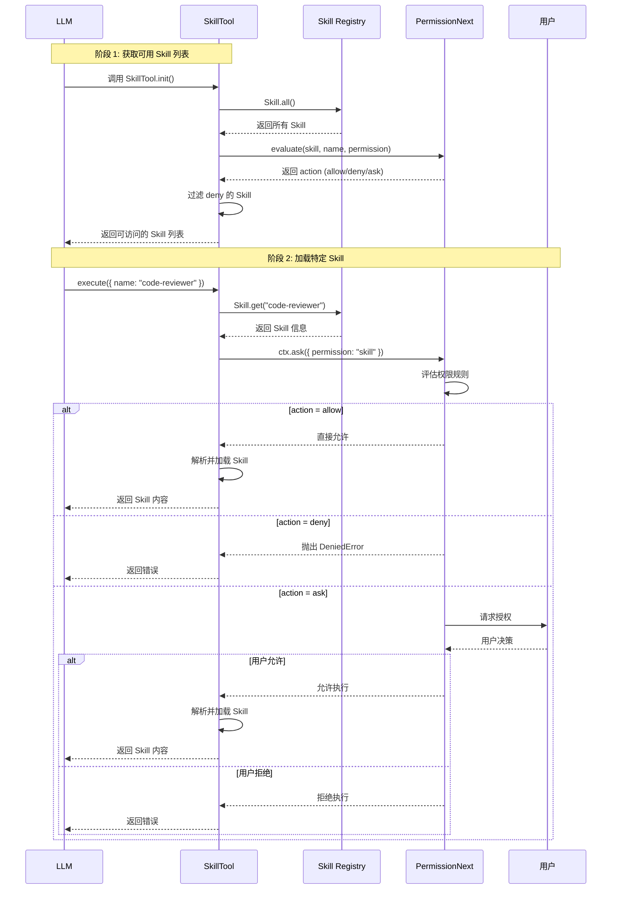

# OpenCode Skill 系统学习教程

> 通过学习OpenCode源码，掌握 Agent Skill 系统的架构设计、实现原理和定制方法。

---

## 目录

| 章节 | 标题           | 难度 |
| ---- | -------------- | ---- |
| 一   | 系统概述       | 入门 |
| 二   | 核心架构       | 进阶 |
| 三   | Skill 定义格式 | 进阶 |
| 四   | 发现与加载机制 | 进阶 |
| 五   | Skill 工具集成 | 进阶 |
| 六   | 权限系统集成   | 高级 |

---

## 一、系统概述

### 1.1 什么是 Skill 系统

**Skill 系统** 是 OpenCode 的 Skill 扩展机制，允许用户定义和管理特定领域的知识、脚本甚至是workflow，可以极大程度提升 Agent 在特定任务中表现。

> 关于 Agent Skill 的详细介绍，推荐阅读 [Claude Agent SKills Overview](https://platform.claude.com/docs/en/agents-and-tools/agent-skills/overview), 关于Agent Skills的使用案例在各种社交平台上已经有非常多的案例了，这里不再赘述。

**核心职责：**

| 职责           | 说明                                 |
| -------------- | ------------------------------------ |
| **Skill 发现** | 自动扫描并发现可用的 Skill           |
| **Skill 管理** | 提供 Skill 的加载、解析和执行机制    |
| **权限控制**   | 结合权限系统控制 Skill 的访问        |
| **内容呈现**   | 将 Skill 内容格式化为 Agent 可读格式 |

**设计目标：**

- **专业化**：为特定任务提供专家级指导
- **可扩展**：用户可自由添加自定义 Skill
- **模块化**：每个 Skill 独立管理，易于维护
- **安全性**：通过权限系统控制 Skill 访问

### 1.2 Skill 系统在整个 Agent 中的位置



**相关文件：**

| 文件           | 路径                                       | 说明             |
| -------------- | ------------------------------------------ | ---------------- |
| **Skill 核心** | `packages/opencode/src/skill/skill.ts`     | Skill 发现与管理 |
| **Skill 工具** | `packages/opencode/src/tool/skill.ts`      | Skill 工具实现   |
| **Skill 导出** | `packages/opencode/src/skill/index.ts`     | 模块导出         |
| **配置解析**   | `packages/opencode/src/config/markdown.ts` | SKILL.md 解析    |

---

## 二、核心架构

### 2.1 架构图

OpenCode中的 Skill 系统主要由三层组成：扫描层、处理层和API层，架构图如下：



### 2.2 类型定义

Skill 的设计是**分层读取**的：先给模型一个“轻量目录”，再按需加载更重的内容，从而**减少上下文占用**。

**第一层：索引信息（轻量）**

- `name`：唯一标识，用于路由到正确 Skill。
- `description`：一句话用途，让模型能“先选对”。
- `location`：文件路径，用于后续按需加载。

这层对应的是“技能清单”，只占很少 token，适合在每次对话中常驻。

**第二层：Skill 文档（中等）**

当模型确定要用某个 Skill 时，再加载 SKILL.md 的正文（本质上就是更完整的操作指引/Prompt）。

**第三层：脚本与附加材料（按需）**

Skill 文档中可以进一步指向脚本、示例、长篇文档或外部资源。模型只在需要时继续读取，避免把所有内容一次性塞进上下文。

这就是“分层设计”的核心价值：**先筛选、再深入、按需扩展**。代码上体现为先通过索引拿到 `name`/`description`，再由工具加载完整内容。相关实现入口：

- [packages/opencode/src/skill/skill.ts](../packages/opencode/src/skill/skill.ts)：Skill 索引与扫描逻辑（聚合 `name`/`description`/`location`，构建可检索的技能清单）。
- [packages/opencode/src/tool/skill.ts](../packages/opencode/src/tool/skill.ts)：Skill 工具入口（根据名称加载 SKILL.md 内容并返回给 Agent）。

### 2.3 错误类型（为什么要显式建模）

教程里更值得关注的是：**Skill 系统为什么需要“可读的错误类型”**，而不仅仅是抛异常。

- **无效 Skill**：通常发生在 frontmatter 解析失败或字段缺失。

对 Agent 而言，错误类型越明确，越容易引导用户修复问题，也更适合做自动化诊断。

> 对应实现仍在 [packages/opencode/src/skill/skill.ts](../packages/opencode/src/skill/skill.ts)，这里强调的是“错误本身就是教学的一部分”。

### 2.4 核心函数（从“Agent视角”理解）

这三个 API 可以用一句话概括为：**“先建索引，再查索引”**。

- `state`：启动时扫描并构建 Skill 索引（让 Agent 拥有“技能地图”）。
- `get(name)`：按名字获取单个 Skill（用于加载具体说明）。
- `all()`：列出所有 Skill（用于让模型进行选择）。

在 Agent 教程里，建议用下面的心智模型理解：

1. **扫描阶段** → 生成“技能清单”。
2. **选择阶段** → LLM 基于 `description` 选 Skill。
3. **执行阶段** → 加载内容并按指引完成任务。

> 实现细节在 [packages/opencode/src/skill/skill.ts](../packages/opencode/src/skill/skill.ts)。在教程中，重点是“流程”，不是“实现细节”。

下面用流程图表达 `addSkill()` 的核心步骤（对应源码的解析、校验、去重与入库）：



---

## 三、Skill 定义格式

### 3.1 SKILL.md 结构

每个 Skill 通过一个 `SKILL.md` 文件定义，必须包含 YAML frontmatter：

```markdown
---
name: skill-identifier
description: A brief description of what this skill does
---

# Skill 标题

这里是技能的详细说明和使用指南...
```

**文件命名规则：**

```
skill-name/
└── SKILL.md           ← 必须命名为 SKILL.md
```

### 3.2 Frontmatter 字段

| 字段            | 类型     | 必填 | 说明                              |
| --------------- | -------- | ---- | --------------------------------- |
| **name**        | `string` | ✅   | Skill 唯一标识符                  |
| **description** | `string` | ✅   | Skill 功能描述（用于 Skill 选择） |

**完整示例：**

```markdown
---
name: code-reviewer
description: Use this skill when asked to review code for bugs, security issues, or style violations
---

# Code Review Skill

## 何时使用

当需要审查代码时使用此 Skill：

- 检测潜在 bug
- 识别安全漏洞
- 检查代码风格
- 验证最佳实践

## 使用步骤

1. **阅读代码**
   - 使用 Read 工具查看目标文件
   - 分析代码结构和逻辑

2. **发现问题**
   - 使用 Grep 搜索敏感操作
   - 检查错误处理

3. **输出报告**
   - 整理发现的问题
   - 提供修复建议
```

### 3.3 目录结构规范

Skill 可以放在以下目录结构中：

```
项目结构/
├── .claude/
│   └── skills/
│       ├── code-reviewer/
│       │   └── SKILL.md
│       └── database-expert/
│           └── SKILL.md
│
├── .opencode/
│   └── skill/
│       ├── api-generator/
│       │   └── SKILL.md
│       └── test-writer/
│           └── SKILL.md
│
└── ~/.claude/                    ← 用户全局目录
    └── skills/
        └── my-custom-skill/
            └── SKILL.md
```

### 3.4 Skill 名称规则

| 规则         | 说明                                                                                                    |
| ------------ | ------------------------------------------------------------------------------------------------------- |
| **唯一性**   | Skill 名称是唯一标识符                                                                                  |
| **命名风格** | 建议使用 kebab-case（如 `code-reviewer`）                                                               |
| **覆盖策略** | **后加载覆盖先加载**（Last Write Wins）。如果发现同名 Skill，后扫描到的会覆盖之前的定义，并产生警告日志 |

**名称冲突处理设计：**

在设计 Skill 系统时，通常有两种策略处理重名：

1. **First Write Wins**：保留第一个发现的 Skill，忽略后续的。适用于保护核心 Skill 不被篡改。
2. **Last Write Wins**：后发现的覆盖之前的。适用于允许用户通过定义同名 Skill 来“重写”或“定制”默认行为。

OpenCode 采用的是 **覆盖策略**，允许通过在更高优先级的目录（后扫描的目录）中定义同名 Skill 来替换原有实现。

> 在我们自己开发Agent过程中，不必遵守这一点，可以按照自己的需求进行修改

```typescript
// packages/opencode/src/skill/skill.ts - 重复名称处理逻辑
if (skills[parsed.data.name]) {
  log.warn("duplicate skill name", {
    name: parsed.data.name,
    existing: skills[parsed.data.name].location,
    duplicate: match,
  })
}
// 后续的同名 Skill 会覆盖前者
skills[parsed.data.name] = {
  name: parsed.data.name,
  description: parsed.data.description,
  location: match,
}
```

---

## 四、发现与加载机制

### 4.1 扫描与加载顺序

Skill 系统按照特定顺序扫描目录。由于采用“覆盖策略”，**扫描顺序决定了优先级**（后扫描的目录具有更高的优先级，可以覆盖先扫描的同名 Skill）。

| 加载顺序 | 路径                             | 类型     | 说明                           |
| -------- | -------------------------------- | -------- | ------------------------------ |
| 1 (最先) | `.claude/skills/**/*.SKILL.md`   | 项目级   | 基础层，通常随项目代码提交     |
| 2        | `~/.claude/skills/**/*.SKILL.md` | 用户级   | 用户全局配置，可覆盖项目级设置 |
| 3 (最后) | `.opencode/skill/**/*.SKILL.md`  | 项目本地 | OpenCode 专用配置，优先级最高  |

**扫描模式：**

```typescript
// packages/opencode/src/skill/skill.ts - glob 模式定义
const OPENCODE_SKILL_GLOB = new Bun.Glob("{skill,skills}/**/SKILL.md")
const CLAUDE_SKILL_GLOB = new Bun.Glob("skills/**/SKILL.md")
```

**注意：** `{skill,skills}` 语法支持两种目录名。

> 个人感觉这其实不是一个好的设计，应该统一成一个目录名，比如都用 skills/，避免用户混淆。

### 4.2 扫描流程



### 4.3 .claude 目录扫描

```typescript
// packages/opencode/src/skill/skill.ts - .claude 目录扫描

// 步骤 1：查找所有 .claude 目录
const claudeDirs = await Array.fromAsync(
  Filesystem.up({
    targets: [".claude"],
    start: Instance.directory,
    stop: Instance.worktree,
  }),
)

// 步骤 2：包含全局 ~/.claude/
const globalClaude = `${Global.Path.home}/.claude`
if (await exists(globalClaude)) {
  claudeDirs.push(globalClaude)
}

// 步骤 3：扫描每个目录
for (const dir of claudeDirs) {
  const matches = await Array.fromAsync(
    CLAUDE_SKILL_GLOB.scan({
      cwd: dir,
      absolute: true,
      onlyFiles: true,
      followSymlinks: true,
      dot: true,
    }),
  ).catch((error) => {
    log.error("failed .claude directory scan for skills", { dir, error })
    return []
  })

  for (const match of matches) {
    await addSkill(match)
  }
}
```

**Filesystem.up() 函数作用：**

```typescript
// 从当前目录向上遍历，查找包含 .claude 的目录
Filesystem.up({
  targets: [".claude"], // 目标目录名
  start: Instance.directory, // 起始目录
  stop: Instance.worktree, // 停止目录（工作树根）
})
```

**示例：**

```
工作目录: /project/user/feature/
工作树:   /project/

Filesystem.up() 查找结果:
├── /project/user/.claude/
└── /project/.claude/
```

### 4.4 .opencode/skill 目录扫描

```typescript
// packages/opencode/src/skill/skill.ts - .opencode/skill 目录扫描

for (const dir of await Config.directories()) {
  for await (const match of OPENCODE_SKILL_GLOB.scan({
    cwd: dir,
    absolute: true,
    onlyFiles: true,
    followSymlinks: true,
  })) {
    await addSkill(match)
  }
}
```

### 4.5 Skill 获取 API

```typescript
// packages/opencode/src/skill/skill.ts - Skill 获取函数

// 获取单个 Skill
export async function get(name: string) {
  return state().then((x) => x[name])
}

// 获取所有 Skill
export async function all() {
  return state().then((x) => Object.values(x))
}
```

**使用示例：**

```typescript
// 获取单个 Skill
const skill = await Skill.get("code-reviewer")
console.log(skill)
// 输出: { name: "code-reviewer", description: "...", location: "/path/to/SKILL.md" }

// 获取所有 Skill
const allSkills = await Skill.all()
console.log(allSkills)
// 输出: [{ name: "code-reviewer", ... }, { name: "database-expert", ... }]
```

---

## 五、Skill 工具集成

在 OpenCode 中，Skill 并不是直接"告诉"LLM 是什么，而是**被封装成 LLM 可以调用的工具（Tool）**。这是 AI Agent 系统的核心设计模式。

### 5.1 核心概念：Skills → Tools

**关键理解：**

| 概念 | 作用 |
|------|------|
| **Skill 文件** | 存储专家知识和指令（供人类阅读的内容） |
| **Skill Tool** | 封装成 LLM 可调用的接口（供 AI 调用的工具） |

**工作流程：**

```
1. 用户提出请求
         ↓
2. LLM 分析请求，决定是否需要调用 skill 工具
         ↓
3. LLM 调用 skill 工具，传入 skill 名称
         ↓
4. 工具执行：读取 skill 文件 → 解析 → 返回给 LLM
         ↓
5. LLM 获得 skill 中的专业知识，继续处理用户请求
```

**为什么这样设计？**

- **按需加载**：LLM 不需要在每次请求时读取所有 skill 内容
- **权限控制**：可以在工具层面控制 LLM 能访问哪些 skill
- **统一接口**：所有功能都通过工具调用，LLM 学习成本低

### 5.2 SkillTool 的角色

`SkillTool` 是连接 Skill 和 LLM 的桥梁：

```typescript
// SkillTool 的职责
interface SkillTool {
  // 1. 告诉 LLM 有哪些 skills 可用
  description: string

  // 2. 定义调用参数（只需要 skill 名称）
  parameters: { name: string }

  // 3. 实际执行：读取并返回 skill 内容
  execute(params): { output }
}
```

**简化理解：**

```
┌─────────────────────────────────────────────────────┐
│                    LLM 的视角                        │
├─────────────────────────────────────────────────────┤
│  "我看到一个叫 'skill' 的工具                          │
│   它可以加载这些 skill:                               │
│   - code-reviewer: 代码审查专家                       │
│   - database-expert: 数据库优化专家                   │
│   - api-designer: API 设计专家                       │
│                                                     │
│   当用户需要代码审查时，我应该调用它，                    │
│   传入 name='code-reviewer'"                         │
└─────────────────────────────────────────────────────┘
```

### 5.3 工具定义与注册

Skill Tool 通过 `Tool.define()` 定义，流程如下：

```typescript
// packages/opencode/src/tool/skill.ts
export const SkillTool = Tool.define("skill", async (ctx) => {
  // Step 1: 读取所有可用的 skills
  const skills = await Skill.all()

  // Step 2: 根据权限过滤（哪些可以展示给 LLM）
  const accessibleSkills = filterByPermission(skills, ctx?.agent)

  // Step 3: 构建工具描述（告诉 LLM 有哪些 skills）
  const description = buildDescription(accessibleSkills)

  // 返回：描述 + 参数定义
  return { description, parameters }
})
```

### 5.4 Skill Tool 如何传递给 LLM

工具定义最终通过 **Vercel AI SDK** 传递给 LLM：

```typescript
// packages/opencode/src/session/prompt.ts
// 所有工具被统一注册
for (const item of await ToolRegistry.tools(model, agent)) {
  tools[item.id] = tool({
    id: item.id,
    description: item.description,  // SkillTool 返回的描述
    inputSchema: jsonSchema(item.parameters),
    async execute(args, options) {
      return await item.execute(args, ctx)
    },
  })
}

// 调用 LLM 时传入工具
streamText({
  tools,        // ← 工具列表在这里
  messages: [...],
  model: languageModel,
})
```

**传递给 LLM 的实际内容（简化）：**

```json
{
  "tools": [
    {
      "name": "skill",
      "description": "Load a skill to get detailed instructions...\n<available_skills>\n  <skill>\n    <name>code-reviewer</name>\n    <description>...</description>\n  </skill>\n</available_skills>",
      "inputSchema": {
        "type": "object",
        "properties": {
          "name": { "type": "string", "description": "The skill identifier" }
        },
        "required": ["name"]
      }
    }
  ]
}
```

### 5.5 工具执行流程

当 LLM 决定调用 `skill` 工具时：

```typescript
// packages/opencode/src/tool/skill.ts
async execute(params, ctx) {
  // 1. 获取指定的 skill
  const skill = await Skill.get(params.name)

  // 2. 请求用户授权（权限系统）
  await ctx.ask({ permission: "skill", patterns: [params.name] })

  // 3. 读取并解析 skill 文件
  const parsed = await ConfigMarkdown.parse(skill.location)

  // 4. 格式化输出，返回给 LLM
  return {
    title: `Loaded skill: ${skill.name}`,
    output: `## Skill: ${skill.name}\n\n${parsed.content}`,
    metadata: { name: skill.name }
  }
}
```

**执行示例：**

```
LLM: call(skill, { name: "code-reviewer" })
     ↓
工具: 读取 .claude/skills/code-reviewer/SKILL.md
     ↓
工具: 解析文件内容
     ↓
返回:
## Skill: code-reviewer

# Code Review Skill
...

LLM: 收到 skill 内容，继续与用户对话
```

### 5.6 完整调用链路图

```
用户: "请帮我审查这段代码"
         │
         ▼
┌────────────────────────────────────────┐
│  SessionPrompt.loop()                  │
│  - 收集所有工具                          │
│  - 构建消息                             │
└────────┬───────────────────┬───────────┘
         │                   │
         ▼                   ▼
┌─────────────────┐   ┌──────────────────┐
│ System Prompt   │   │Tools (含 skill tool) │
│ (Agent 指令)    │   │                   │
└────────┬────────┘   └────────┬─────────┘
         │                     │
         └──────────┬──────────┘
                    ▼
         ┌───────────────────────┐
         │ LLM API (streamText)  │
         │ - messages: prompt    │
         │ - tools: skill 等     │
         └────────┬──────────────┘
                  │
                  ▼
         ┌───────────────────────┐
         │ LLM 决定调用 skill     │
         │ call(skill, {name:    │
         │   "code-reviewer"})   │
         └────────┬──────────────┘
                  │
                  ▼
         ┌───────────────────────┐
         │ SkillTool.execute()   │
         │ - 读取 skill 文件     │
         │ - 返回内容给 LLM      │
         └────────┬──────────────┘
                  │
                  ▼
         ┌───────────────────────┐
         │ LLM 获得专业知识       │
         │ 继续处理用户请求       │
         └───────────────────────┘
```


### 📝 思考题：Skill 的参数怎么传递？

**场景：**

假设你创建一个 `search-from-github` skill，用于从 GitHub 搜索信息。你的 SKILL.md 可能是这样的：

```markdown
---
name: search-from-github
description: Search GitHub repositories for code
---

## What I do
Search GitHub using the `gh` CLI tool.

## How to use
1. Extract `query` and `repo` from user request
2. Run: `gh search code <query> --repo <repo> --limit 10`
3. Present results to user
```

**问题：**

当你调用 `call(skill, { name: "search-from-github" })` 时，**只传递了 `name` 参数**。

但是 `search-from-github` 这个搜索任务需要：
- `query` - 搜索什么内容
- `repo` - 在哪个仓库搜索

**这些参数是哪里来的？是怎么传递给 LLM 的？是在什么时候传递给LLM的？**

**提示：**
可以使用任何你喜欢的 AI Coding 工具分析OpenCode相关的源码来辅助你理解这个问题

---

## 六、权限系统集成

### 6.1 Skill 权限类型

Skill 作为一种权限类型进行管理：

| 权限类型  | 说明                       |
| --------- | -------------------------- |
| **skill** | 控制是否允许加载特定 Skill |

### 6.2 权限过滤

SkillTool 在提供可用 Skill 列表时，会根据 Agent 权限进行过滤：

```typescript
// packages/opencode/src/tool/skill.ts
const agent = ctx?.agent
const accessibleSkills = agent
  ? skills.filter((skill) => {
      // 评估权限规则
      const rule = PermissionNext.evaluate("skill", skill.name, agent.permission)
      return rule.action !== "deny" // 排除被拒绝的 Skill
    })
  : skills // 无 agent 时返回全部
```

**权限评估流程：**

```
Skill: "code-reviewer"
Agent 权限: { "skill": { "code-*": "allow", "security-*": "deny" } }

评估步骤:
1. 匹配 "code-reviewer" ~ "code-*"  → allow
2. 不匹配 "security-*" 规则
3. 最终结果: allow (可见且可用)
```

### 6.3 权限请求

当实际加载 Skill 时，会请求 `skill` 权限：

```typescript
// packages/opencode/src/tool/skill.ts
await ctx.ask({
  permission: "skill", // 权限类型
  patterns: [params.name], // Skill 名称
  always: [params.name], // 记住选择
  metadata: {},
})
```

### 6.4 权限配置示例

权限配置位于 `opencode.jsonc` 文件的 `agent.<agentName>.permission` 字段中。OpenCode 支持多级配置，优先级从高到低为：

1. **项目配置** - 项目目录下的 `opencode.jsonc` 或 `opencode.json`
2. **用户配置** - `~/.config/opencode/` 目录
3. **远程配置** - 组织提供的远程配置

> **提示**：OpenCode 使用 JSONC（带注释的 JSON）格式，允许在配置文件中添加注释。

```typescript
// opencode.jsonc - Agent 权限配置
{
  "agent": {
    "build": {
      // 允许特定 Skill
      "permission": {
        "skill": {
          "code-reviewer": "allow",        // 允许代码审查
          "database-expert": "allow",      // 允许数据库专家
          "*": "ask"                       // 其他 Skill 需要询问
        }
      }
    },
    "plan": {
      // 禁止特定 Skill
      "permission": {
        "skill": {
          "experimental-*": "deny",        // 禁止实验性 Skill
          "test-skill": "deny"             // 禁止测试 Skill
        }
      }
    }
  }
}
```

**权限配置格式说明：**

| 格式 | 说明 |
| ---- | ---- |
| `"tool-name": "allow"` | 允许所有匹配该权限类型的操作 |
| `"tool-name": "deny"` | 禁止所有匹配该权限类型的操作 |
| `"tool-name": "ask"` | 每次使用时询问用户 |
| `"tool-name": { "pattern": "action" }` | 按模式细粒度控制 |

**配置示例说明：**
- `"code-reviewer": "allow"` - 允许 `code-reviewer` Skill
- `"database-expert": "allow"` - 允许 `database-expert` Skill
- `"*": "ask"` - 其他 Skill 每次使用时询问
- `"experimental-*": "deny"` - 禁止所有以 `experimental-` 开头的 Skill

### 6.5 完整权限流程图



---

## 附录

### A. 目录优先级速查

**生效优先级（高 -> 低）：**

| 优先级       | 路径                | 说明                           |
| ------------ | ------------------- | ------------------------------ |
| **1 (最高)** | `.opencode/skill/`  | 项目本地配置，覆盖所有其他配置 |
| **2**        | `~/.claude/skills/` | 用户个人习惯，覆盖项目默认配置 |
| **3 (最低)** | `.claude/skills/`   | 项目基础配置                   |

_注：这种“用户覆盖项目”的逻辑允许开发者在不修改项目共享代码的情况下，使用自己习惯的 Skill 版本。_

### B. 错误处理速查

| 错误类型                 | 触发条件           | 处理方式                           |
| ------------------------ | ------------------ | ---------------------------------- |
| `SkillInvalidError`      | YAML 解析失败      | 检查 frontmatter 语法              |
| `SkillNameMismatchError` | 文件名与 name 不符 | 验证 name 字段                     |
| 重复名称警告             | 同名 Skill 多个    | 后加载的覆盖前者，如需共存请重命名 |
